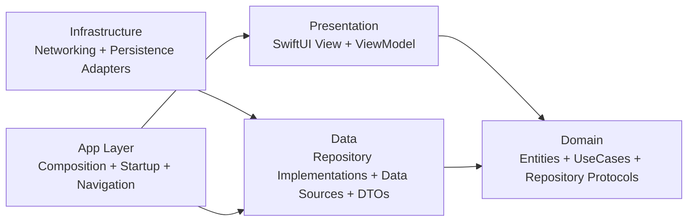

# Architecture Overview

## Selected Architecture

This project uses:

- Clean Architecture for dependency boundaries.
- MVVM for presentation composition.
- Composition Root pattern for dependency wiring.

## Why This Combination

- Clean Architecture makes business logic independent from UI and frameworks.
- MVVM fits SwiftUI state-driven rendering naturally.
- Composition Root avoids hidden dependency creation and improves testability.

## Dependency Rule

Dependencies must point inward:

- Presentation can depend on Domain and Core.
- Data can depend on Domain and Core.
- Domain must not depend on Data, Presentation, or framework-heavy modules.

## Layer Responsibility Summary

### Higher-level layers

- `App`: startup orchestration, dependency graph, app-level routing entry.
- `Presentation`: view state and interaction mapping.

### Lower-level layers

- `Data`: implementation details of repository protocols.
- `Infrastructure`: concrete adapters for system APIs like URLSession and UserDefaults.

### Core layer

- `Core`: cross-cutting shared types (errors, design tokens, base state models, logging).

## Source of Truth

- View models own UI state.
- Domain entities own business meaning.
- Repository protocols in Domain define data access contracts.
- Use cases are concrete feature-domain types (for example `AnalyzeAcneFromImageUseCase`) and are not required to conform to a shared Core protocol.
- Concrete data sources in Data/Infrastructure provide implementation details.
