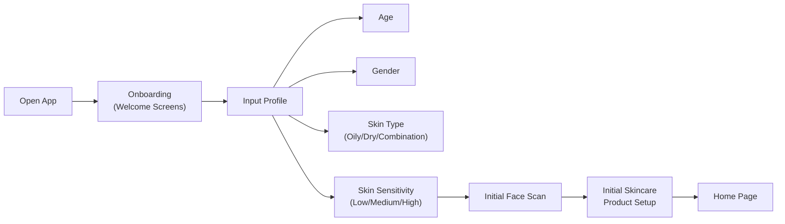
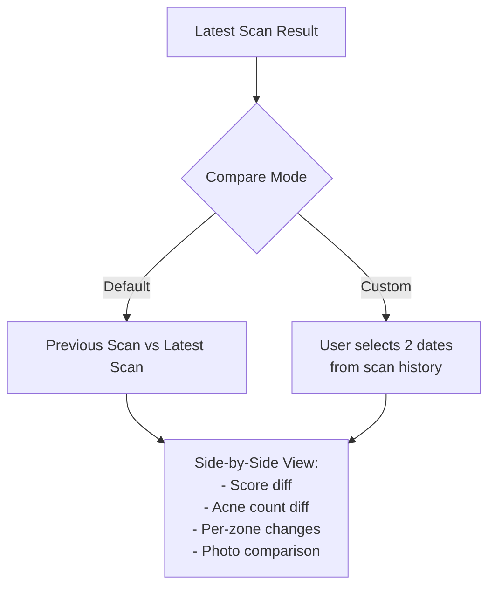
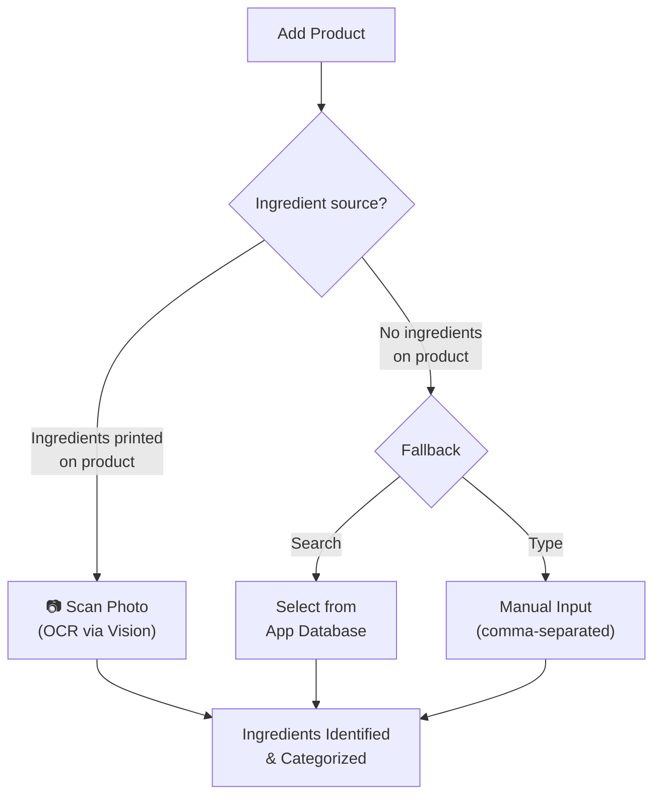
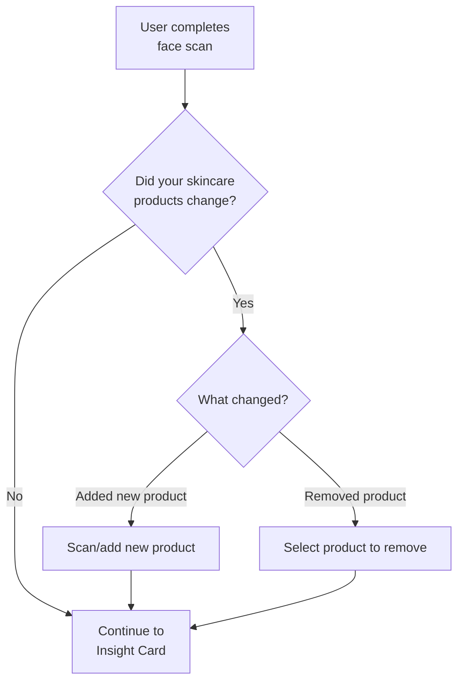
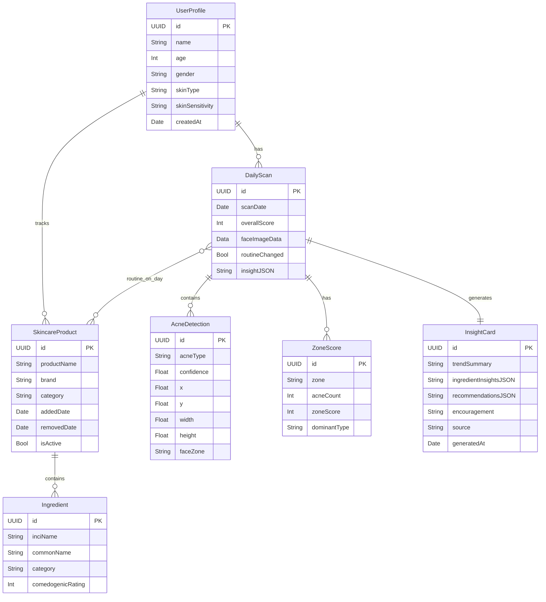

# 📋 Product Requirements Document (PRD) — Acne Tracker App

> **Version**: 2.0 (Revised post-team discussion)
> **Author**: Baren Baruna Harahap
> **Date**: July 31, 2026
> **Sprint Duration**: 2 Weeks (July 28 – August 10, 2026)
> **Platform**: iOS 17+ (SwiftUI + Core ML)

---

## 1. Product Overview

### 1.1 Problem Statement
People struggling with acne often don't know which skincare products help or hurt their skin. They lack tools to objectively track acne progress, understand skincare ingredients, and correlate product usage with skin changes over time.

### 1.2 Solution
An iOS app that combines **AI-powered face scanning** (on-device Core ML) with **skincare ingredient tracking** and **LLM-powered personalized insights** to help users understand their acne, track progress, and make informed skincare decisions.

### 1.3 Target Users
- People aged 15–35 with mild to moderate acne
- Users who don't understand skincare ingredients
- Users seeking objective skin progress tracking

### 1.4 Value Proposition
| Feature | User Benefit |
|---|---|
| Face scanning with acne detection | Objective, consistent acne measurement |
| Acne scoring & trend tracking | Visual progress over days/weeks/months |
| Ingredient scanning & education | Understand what's in products |
| AI-powered insights | Personalized ingredient-acne correlation |

---

## 2. Core Features (MVP Scope — 2 Weeks)

### 2.1 Onboarding Flow



**Details:**
- 3–4 onboarding screens explaining the app
- Profile inputs: Age, Gender, Skin Type, Skin Sensitivity
- **First face scan** happens during onboarding (State 0 → establishes baseline)
- **First skincare product scan** happens right after face scan
- After onboarding → Home Page

---

### 2.2 Face Scanning & Acne Detection

> [!IMPORTANT]
> **Team Decision**: 1 scan per day, user can scan anytime but only 1 counts. If re-scanned same day, it overwrites the previous scan.

#### 2.2.1 Scanning Protocol
| Rule | Detail |
|---|---|
| Frequency | **1 scan per day** (max) |
| Timing | Anytime — but recommended post-cleansing (night routine) for consistency |
| Overwrite | Same-day re-scan overwrites previous result |
| Capture method | Multi-angle capture (similar to Face ID setup — front, left turn, right turn) |
| Reminder | **Weekly push notification** reminder to scan |

#### 2.2.2 ML Model — Already Trained ✅
Your existing Core ML model ([Acne 1.mlmodel](file:///Users/barenbaruna/Apple%20Developer%20Academy%20IL%202026/Challenge%204/Acne.mlproj/Models/Acne%201.mlmodel)) detects **4 acne types**:

| Acne Type | Training Annotations | Severity Weight |
|---|---|---|
| Whitehead & Blackhead (Comedones) | 2,015 | ×1 |
| Papules | 9,604 | ×2 |
| Pustules | 11,129 | ×3 |
| Nodules & Cysts | 17,102 | ×5 |

> [!NOTE]
> The model was trained using **Roboflow Acne04 Detection** dataset with **~40K annotations** across **~3K images**. Task type: **Object Detection** with bounding boxes.

#### 2.2.3 Face Zone Mapping
Using Apple's `VNDetectFaceLandmarksRequest`, detected acne bounding boxes are mapped to **5 facial zones**:

| Zone | Indonesian | GAGS Factor |
|---|---|---|
| Forehead | Dahi | ×2 |
| Right Cheek | Pipi Kanan | ×2 |
| Left Cheek | Pipi Kiri | ×2 |
| Nose | Hidung | ×1 |
| Chin | Dagu | ×1 |

**Technical approach:**
1. Detect face + landmarks via Vision framework
2. Define zone polygons from landmark points (eyebrow midpoints, nose tip, jaw contour)
3. For each acne bounding box center, determine which zone it falls into
4. Aggregate counts per zone

#### 2.2.4 Acne Scoring Formula

**Primary Score: Skin Health Score (0–100, higher = better)**

```
Step 1: Weighted Acne Count
  weighted_count = (comedones × 1) + (papules × 2) + (pustules × 3) + (nodules_cysts × 5)

Step 2: Normalize (MaxExpected = 60, calibrate during testing)
  raw_score = min(weighted_count, MaxExpected) / MaxExpected × 100

Step 3: Invert to "health" perspective
  skin_health_score = 100 - raw_score
```

**Example:**
- 3 comedones, 2 papules, 1 pustule, 0 nodules
- Weighted: (3×1) + (2×2) + (1×3) + (0×5) = 10
- Raw: 10/60 × 100 = 16.7
- **Skin Health Score: 83/100** ✅

**Per-Zone Score** (using modified GAGS):
```
zone_score = zone_factor × highest_lesion_severity_in_zone
total_gags = sum(all zone_scores)  // Range: 0–44
```

**Severity Labels:**

| Score Range | Label | Color |
|---|---|---|
| 85–100 | Excellent | 🟢 Green |
| 70–84 | Good | 🟡 Yellow-Green |
| 50–69 | Moderate | 🟠 Orange |
| 25–49 | Needs Attention | 🔴 Red |
| 0–24 | Severe | 🔴 Dark Red |

---

### 2.3 Scan Results Display

#### 2.3.1 Overall Score Card
- **Large circular score indicator** (0–100) with color gradient
- Severity label text (Excellent / Good / Moderate / etc.)
- Trend arrow (↑ improving, ↓ worsening, → stable) vs previous scan

#### 2.3.2 Acne Breakdown
| Data Point | Display |
|---|---|
| Total acne count | Number badge |
| By type | List: Papules: 3, Pustules: 1, Comedones: 5, Nodules: 0 |
| By zone | Face map illustration with per-zone counts/colors |

#### 2.3.3 Comparison View

> [!IMPORTANT]
> **Team Decision**: Default comparison = Previous Scan ↔ Latest Scan. User can select custom date ranges.



**Comparison data shown:**
- Score delta (e.g., +5 points improvement)
- Acne count change per type
- Per-zone improvement/worsening
- Side-by-side scan photos

---

### 2.4 Progress & Trends

#### 2.4.1 Trend Charts (Swift Charts)

**Default view**: Daily scores for the current week (last 7 scans)

**Filter options:**
| Filter | Data Shown |
|---|---|
| Weekly (default) | Last 7 days of scans |
| Monthly | Last 30 days |
| 3 Months | Last 90 days |

**Chart types:**
- **Line chart**: Overall score over time (primary)
- **Stacked bar chart**: Acne count by type per day
- **Face heatmap**: Per-zone severity over time (stretch goal)

#### 2.4.2 Progress Metrics
- Best score ever
- Average score (7-day / 30-day)
- Longest improvement streak
- Most improved zone

---

### 2.5 Skincare Ingredient Tracking

#### 2.5.1 Product Input Methods



**OCR Implementation** (Apple Vision):
- `VNRecognizeTextRequest` with `.accurate` recognition level
- Language correction enabled
- Post-processing: split by commas, normalize to INCI names
- User can edit/correct OCR results before saving

#### 2.5.2 Ingredient Database (Local Rule-Based — JSON)

Embedded JSON database with **~200–300 common skincare ingredients** categorized into:

| Category | Examples | Color Code |
|---|---|---|
| 🟢 Acne-fighting | Salicylic acid, Benzoyl peroxide, Azelaic acid, Tea tree oil | Green |
| 🔵 Soothing | Aloe vera, Centella asiatica, Allantoin, Bisabolol | Blue |
| 🟡 Barrier-support | Ceramides, Hyaluronic acid, Glycerin, Squalane | Yellow |
| 🟠 Exfoliating | Glycolic acid (AHA), Salicylic acid (BHA), Gluconolactone (PHA) | Orange |
| 🔴 Potentially irritating | Denatured alcohol, Fragrance/Parfum, Essential oils, SLS | Red |
| ⚪ Neutral/Moisturizing | Water, Butylene glycol, Dimethicone | Gray |

**Each ingredient entry includes:**
```json
{
  "inci_name": "Salicylic Acid",
  "common_names": ["salicylic acid", "BHA"],
  "category": ["acne_fighting", "exfoliating"],
  "type": "BHA",
  "acne_relevance": "Unclogs pores, reduces comedones and papules",
  "caution": "Can cause dryness; avoid combining with retinoids initially",
  "comedogenic_rating": 0,
  "target_acne_types": ["papules", "whitehead_blackhead", "pustules"],
  "avoid_with_acne_types": []
}
```

> [!NOTE]
> **This is rule-based, NOT an external API dependency.** The JSON file ships with the app. This ensures offline support and avoids API rate limits for ingredient lookup.

#### 2.5.3 Ingredient Education Flow

After scanning/adding a product, users see:
1. **Ingredient list** with color-coded categories
2. **Tap any ingredient** → explanation card:
   - What it does
   - Relevance to user's acne type
   - Cautions/conflicts with other actives
3. **Product summary card**:
   - "This product contains 2 acne-fighting ingredients and 1 potentially irritating ingredient"

#### 2.5.4 Product Change Detection

> [!IMPORTANT]
> **Team Decision**: Every time the user does a face scan, the app asks: "Ada perubahan produk skincare?" (Did your skincare products change?)



---

### 2.6 AI-Powered Insights (Gemini LLM)

#### 2.6.1 Architecture: Hybrid (Rule-Based + LLM)

```
┌─────────────────────────────────────────────────────┐
│                   iOS App (On-Device)                │
│                                                      │
│  ┌────────────┐    ┌─────────────┐                  │
│  │ Camera     │───▶│ Core ML     │──▶ Acne Metrics  │
│  │ (Face)     │    │ Acne 1.ml   │   (JSON)         │
│  └────────────┘    └─────────────┘                  │
│                                                      │
│  ┌────────────┐    ┌─────────────┐                  │
│  │ Camera     │───▶│ Vision OCR  │──▶ Ingredients   │
│  │ (Product)  │    │ + Rule DB   │   (JSON)         │
│  └────────────┘    └─────────────┘                  │
│                                                      │
│  ┌──────────────────────────────────────────────┐   │
│  │         SwiftData (Local Storage)             │   │
│  │  Scans | Scores | Products | Ingredients      │   │
│  └──────────────────────────────────────────────┘   │
│                        │                             │
│                        ▼                             │
│  ┌──────────────────────────────────────────────┐   │
│  │  Insight Engine                               │   │
│  │  ┌──────────────┐   ┌────────────────────┐   │   │
│  │  │ Rule-Based   │   │ Gemini 2.0 Flash   │   │   │
│  │  │ (Offline     │   │ (Cloud LLM)        │   │   │
│  │  │  Fallback)   │   │ via Google AI SDK   │   │   │
│  │  └──────────────┘   └────────────────────┘   │   │
│  └──────────────────────────────────────────────┘   │
│                        │                             │
│                        ▼                             │
│  ┌──────────────────────────────────────────────┐   │
│  │           Daily Insight Card (UI)             │   │
│  └──────────────────────────────────────────────┘   │
└─────────────────────────────────────────────────────┘
```

> [!IMPORTANT]
> **Privacy Rule**: Face images NEVER leave the device. Only structured JSON metrics (scores, counts, ingredient lists) are sent to the Gemini API.

#### 2.6.2 LLM Selection: Google Gemini 2.0 Flash ✅

| Criteria | Gemini 2.0 Flash |
|---|---|
| **Cost** | **FREE** (Google AI Studio) |
| **Rate Limits (Free)** | 15 RPM, 1,500 RPD, 1M TPM |
| **Speed** | Very fast (~1–3 seconds) |
| **JSON output** | Excellent (structured output mode) |
| **Multimodal** | Yes (can accept images too) |
| **Swift SDK** | Official: `google/generative-ai-swift` |

> [!TIP]
> 1,500 requests/day is **more than enough** for a single-user app with 1 scan/day. Even in testing with 100 users, that's only ~100 requests/day.

**Alternative free option**: Gemini 1.5 Flash (same limits, slightly older model)

#### 2.6.3 LLM Prompt Design

The prompt sent to Gemini packages:
1. **System instructions**: Educational-only tone, no medical diagnoses
2. **User profile**: Skin type, sensitivity, age
3. **Scan metrics**: Score, acne counts by type, per-zone breakdown, score trend
4. **Current routine**: List of products & their ingredients
5. **History**: Previous scores, product changes

**Expected JSON output:**
```json
{
  "trend_summary": "Your skin health score improved by 8 points this week...",
  "ingredient_insights": [
    {
      "ingredient": "Niacinamide",
      "category": "soothing",
      "relevance": "May help reduce inflammation associated with your papules",
      "recommendation": "keep"
    }
  ],
  "active_conflicts": ["Using AHA and retinol together may increase irritation"],
  "recommendations_to_add": ["Consider a BHA product for comedone-prone areas"],
  "recommendations_to_avoid": ["Fragrance may be contributing to cheek irritation"],
  "encouragement": "Great progress! Your nose area shows significant improvement.",
  "disclaimer": "This is educational information only. Consult a dermatologist."
}
```

#### 2.6.4 Offline Fallback (Rule-Based Insights)
When Gemini is unavailable (no internet, rate limit), the app generates basic insights locally:
- Score comparison vs previous scan
- Ingredient category warnings from the local JSON DB
- Comedogenic ingredient alerts
- Active ingredient conflict warnings (e.g., AHA + Retinol)

#### 2.6.5 Example Insight Cards

**Example 1 — Daily Check-in:**
> "Today's scan shows **moderate acne activity (Score: 67/100)**. Your routine today included cleanser, niacinamide serum, and sunscreen — you skipped exfoliation. Your skin has been **slightly calmer on similar days** where you skip exfoliants."

**Example 2 — Ingredient Education:**
> "This product contains **salicylic acid**, which is commonly used for acne-prone skin. Your current scan shows **fewer clogged-appearing spots** in the nose area. Keep using this product and monitor over the next 7–14 days."

**Example 3 — Trigger Warning:**
> "⚠️ Your score dropped 12 points since adding **Product X** 5 days ago. This product contains **fragrance (parfum)** and **denatured alcohol**, which are commonly associated with skin irritation. Consider monitoring for another week or consulting a dermatologist."

---

### 2.7 Reminders & Notifications

| Reminder | Frequency | Type |
|---|---|---|
| Daily scan reminder | Daily (user-set time) | Local push notification |
| Weekly progress summary | Weekly (Sunday evening) | Local notification |
| Product change check | Every scan session | In-app prompt |

---

## 3. Data Model (SwiftData)

### 3.1 Entity Relationship



### 3.2 Key Data Rules
- **DailyScan**: Only 1 per calendar day (same-day re-scan overwrites)
- **faceImageData**: Stored locally only, never transmitted
- **InsightCard.source**: `"gemini"` or `"rule_based"` (for tracking fallback usage)
- **SkincareProduct.isActive**: Tracks whether product is currently in routine

---

## 4. Screen-by-Screen Specification

### 4.1 App Navigation Structure

```mermaid
flowchart TD
    A["Tab Bar"] --> B["🏠 Home"]
    A --> C["📊 Progress"]
    A --> D["🧴 Skincare"]
    A --> E["👤 Profile"]

    B --> B1["Today's Score Card"]
    B --> B2["Quick Scan Button"]
    B --> B3["Latest Insight Card"]
    B --> B4["Weekly Mini Chart"]

    C --> C1["Score Trend Chart\n(Line Graph)"]
    C --> C2["Acne Breakdown\n(By Type)"]
    C --> C3["Zone Heatmap"]
    C --> C4["Compare View\n(Side-by-Side)"]
    C --> C5["Filter: Week/Month/3Mo"]

    D --> D1["Active Products List"]
    D --> D2["Add Product\n(Scan/Manual)"]
    D --> D3["Product Detail\n(Ingredients)"]
    D --> D4["Ingredient Education"]

    E --> E1["Profile Settings"]
    E --> E2["Scan History"]
    E --> E3["Notifications"]
    E --> E4["About / Disclaimer"]
```



### 4.2 Screen Details

#### Home Screen
- **Hero**: Large circular score gauge (today's score or "Scan Now" CTA if not scanned)
- **Trend mini-chart**: Last 7 days sparkline
- **Insight card**: Latest AI insight (swipeable)
- **Quick actions**: "Scan Face" button (prominent), "Add Product" secondary

#### Scan Flow Screen
1. Camera view with face outline guide (like Face ID)
2. "Hold still" → Capture front face
3. "Turn left slightly" → Capture left profile
4. "Turn right slightly" → Capture right profile
5. Processing animation → Results

#### Scan Result Screen
- Score gauge (animated reveal)
- Score delta vs previous (↑↓→)
- Acne type breakdown (list with counts)
- Face zone map (illustrated face with zone highlights)
- "Did your routine change?" prompt
- "View Insight" button → Insight Card

#### Progress Screen
- **Tab: Trend** — Line chart of scores over time with filter (Week/Month/3Mo)
- **Tab: Breakdown** — Stacked bar chart of acne types over time
- **Tab: Compare** — Side-by-side scan comparison (default: prev vs latest, custom date picker)

#### Skincare Screen
- List of active products (with ingredient count badges)
- "Add Product" FAB → Camera scan or manual input
- Product detail → Ingredient list with category color pills
- Tap ingredient → Education bottom sheet

#### Profile Screen
- User info (age, gender, skin type, sensitivity) — editable
- Scan history list
- Notification settings
- Disclaimer / About

---

## 5. Technical Stack

| Component | Technology |
|---|---|
| **Language** | Swift 5.9+ |
| **UI Framework** | SwiftUI |
| **Minimum iOS** | iOS 17.0 |
| **ML Inference** | Core ML (Object Detection) |
| **Face Detection** | Apple Vision (`VNDetectFaceLandmarksRequest`) |
| **OCR** | Apple Vision (`VNRecognizeTextRequest`) |
| **LLM** | Google Gemini 2.0 Flash (via `google/generative-ai-swift` SDK) |
| **Local Storage** | SwiftData |
| **Charts** | Swift Charts (iOS 16+) |
| **Notifications** | UserNotifications framework |
| **Camera** | AVFoundation |
| **Architecture** | MVVM |

### 5.1 Dependencies (Swift Packages)

| Package | Source | Purpose |
|---|---|---|
| `google/generative-ai-swift` | SPM (GitHub) | Gemini API integration |

> [!TIP]
> Everything else uses **native Apple frameworks** — no third-party dependencies for ML, OCR, camera, storage, or charts. This minimizes dependency risk in a 2-week sprint.

### 5.2 API Key Management
- Store Gemini API key in a `.xcconfig` file (not committed to git)
- Access via `Bundle.main.infoDictionary` in code
- Add `.xcconfig` to `.gitignore`

---

## 6. Safety & Compliance

### 6.1 Medical Disclaimer Rules
The app MUST include:

> [!CAUTION]
> **All screens with AI insights MUST display:**
> "This app provides educational information only. It does not diagnose, treat, or prescribe. Always consult a dermatologist for medical advice."

### 6.2 Language Guidelines
| ✅ Use | ❌ Never Use |
|---|---|
| "commonly used for" | "will cure" |
| "may help with" | "causes acne" |
| "generally associated with" | "you have [condition]" |
| "consider consulting a dermatologist" | "stop using this product" |
| "your scan shows patterns consistent with" | "you are diagnosed with" |

### 6.3 Privacy
- Face images stored **on-device only** (SwiftData / local storage)
- No face images sent to any cloud service
- Only structured JSON metrics (scores, counts) sent to Gemini API
- No user analytics or tracking
- Clear privacy policy in-app

---

## 7. Sprint Plan (2 Weeks)

### Week 1: Foundation & Core Features

| Day | Tasks | Owner |
|---|---|---|
| Day 1–2 | Project setup, SwiftData models, onboarding UI, profile input | Dev |
| Day 2–3 | Camera capture flow, Core ML integration, acne detection pipeline | Dev |
| Day 3–4 | Face zone mapping (Vision landmarks), scoring formula, scan result screen | Dev |
| Day 4–5 | Home screen, score display, insight card UI, tab navigation | Dev + Design |
| Day 5 | OCR ingredient scanning, ingredient JSON database setup | Dev |

### Week 2: Intelligence & Polish

| Day | Tasks | Owner |
|---|---|---|
| Day 6–7 | Gemini API integration, prompt engineering, insight generation | Dev |
| Day 7–8 | Progress charts (Swift Charts), trend views, comparison view | Dev |
| Day 8–9 | Skincare product management, ingredient education flow | Dev |
| Day 9–10 | Product change detection flow, notification setup, offline fallback | Dev |
| Day 10 | Bug fixes, UI polish, testing on device, final review | All |

---

## 8. Open Questions for Team Review

> [!IMPORTANT]
> ### Q1: Multi-Angle Scan Implementation
> The team discussed "scan overall secara keseluruhan (mirip bikin FaceID)" — do you want:
> - **Option A**: Single front-facing photo (simpler, faster, less accurate for cheeks)
> - **Option B**: 3-angle capture (front + left turn + right turn) like Face ID (more accurate for cheek zones, but more complex UX)
> 
> **Recommendation**: Option B for better zone accuracy, but Option A for MVP if time is tight.

> [!IMPORTANT]
> ### Q2: Acne Score — "Skin Health" (100=best) vs "Acne Severity" (100=worst)?
> The PRD proposes **Skin Health Score (100 = best skin, 0 = worst)**. This feels more positive and motivating.
> - Do you prefer **100 = best** (health framing) or **100 = worst** (severity framing)?

> [!IMPORTANT]
> ### Q3: Gemini API Key Provisioning
> Who will create the Google AI Studio account and generate the API key?
> - Free tier: 1,500 requests/day — sufficient for development and demo
> - The Python prototype from the previous session still needs a key for testing

> [!WARNING]
> ### Q4: Model Accuracy
> The existing `Acne 1.mlmodel` was trained on the Roboflow Acne04 dataset. Have you tested it on:
> - Different skin tones?
> - Various lighting conditions?
> - Different camera distances?
> 
> If accuracy is low, we may need to supplement with additional training data or adjust confidence thresholds.

> [!IMPORTANT]
> ### Q5: Chart Type for Scan Results
> For presenting acne data per-scan, which visualization do designers prefer?
> - **Pie chart**: Acne type distribution (% of each type)
> - **Horizontal bar chart**: Count per type
> - **Face map illustration**: Colored zones on an illustrated face
> - **Combination of the above**
> 
> **Recommendation**: Face map + horizontal bar chart (pie charts are hard to read with 4 categories of similar sizes)

---

## 9. Verification Plan

### 9.1 Automated Testing
```bash
# Unit tests for scoring formula
xcodebuild test -scheme AcneTracker -destination 'platform=iOS Simulator,name=iPhone 16'

# Test Gemini prompt with Python prototype
python3 test_prompt.py --scan-data sample_scan.json
```

### 9.2 Manual Verification
- [ ] Face scan captures and detects acne correctly on test photos
- [ ] Score calculation matches expected values for sample inputs
- [ ] Zone mapping places acne in correct facial regions
- [ ] OCR correctly reads ingredient lists from product photos
- [ ] Gemini returns valid JSON insights
- [ ] Offline fallback shows rule-based insights when no internet
- [ ] Same-day re-scan overwrites previous scan
- [ ] Comparison view correctly shows score deltas
- [ ] Charts render correctly with 7/30/90 day filters
- [ ] Weekly notification fires correctly

### 9.3 Device Testing
- Test on physical iPhone (camera access required)
- Test under different lighting conditions
- Test with various skincare product labels (English + Indonesian)

---

## 10. Future Enhancements (Post-MVP)

| Feature | Priority | Description |
|---|---|---|
| Barcode scanning for products | High | Use DataScannerViewController to scan barcodes → query Open Beauty Facts API |
| Photo journal | Medium | Side-by-side photo timeline showing face changes |
| Dermatologist sharing | Medium | Export scan history as PDF for dermatologist consultation |
| Community ingredient reviews | Low | Crowdsourced ingredient effectiveness ratings |
| Advanced correlation engine | Low | Statistical analysis (not just LLM) of ingredient-acne correlations over 30+ days |
| Multi-language support | Medium | Indonesian / English toggle |
| Apple Watch companion | Low | Quick daily scan reminder + score widget |
